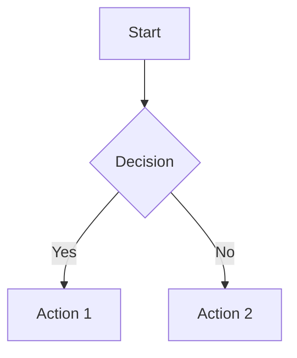

# MossMD

**CodeMirror 6 的 Obsidian 风格实时预览编辑器（React），带自定义块语法扩展。**
**Obsidian-style live preview for CodeMirror 6, in React — with custom block syntax extensions.**

[](https://www.npmjs.com/package/mossmd)
[](./LICENSE)

A markdown editor where formatting renders as you type — headings, bold, tables, images, task lists — while the text underneath stays plain markdown. The document you read is the document you edit: no split preview, and copy/save/round-trip behave exactly like a plain textarea full of markdown. An optional reading mode locks that same rendered surface without introducing a separate preview document.

一个边输入边渲染格式的 markdown 编辑器——标题、加粗、表格、图片、任务列表——同时底层文本始终保持纯 markdown。你读到的文档就是你编辑的文档：无分栏预览，复制/保存/往返行为与满载 markdown 的普通 textarea 完全一致。可选的阅读模式锁定同一渲染表面，无需引入独立的预览文档。

## Features / 特性

- **Live preview / 实时预览.** Headings, emphasis, `==highlights==`, links, images, and tables render inline; the raw syntax appears only on the line your cursor is on, then tucks itself away when you move on. / 标题、强调、`==高亮==`、链接、图片和表格内联渲染；原始语法只显示在光标所在行，离开后自动收起。
- **Raw markdown is the source of truth / 原始 markdown 是唯一数据源.** Every decoration is view-only, so copy, save, and round-trip through any other markdown tool are byte-for-byte identical to a plain textarea. / 每个装饰只读，因此复制、保存、经任意 markdown 工具往返都与普通 textarea 逐字节一致。
- **Virtualized and layout-stable / 虚拟化与布局稳定.** CM6 renders only the viewport, and lines never reflow when you click into them — open a 500-page document and scroll stays smooth, even on iOS. / CM6 只渲染视口，点击进入行时行从不回流——打开 500 页文档滚动依旧流畅，即使在 iOS 上。
- **WYSIWYG tables / 所见即所得表格.** Click a cell to edit in place; wide tables scroll horizontally inside a contained wrapper instead of stretching the page. Right-click for context menu (insert/delete rows/columns, alignment). / 点击单元格就地编辑；宽表在独立 wrapper 内横向滚动而不撑宽页面。右键弹出菜单（插入/删除行列、对齐）。
- **Wiki links / Wiki 链接.** `[[target]]` / `[[target|label]]` with async resolution, autocomplete, and click-to-open — for knowledge-base-style cross-linking. / 支持异步解析、自动补全和点击打开，用于知识库式交叉引用。
- **Smart lists / 智能列表.** Enter continues tight bullets and task checkboxes, Enter on an empty item dedents, and `- [ ]` becomes a real, clickable checkbox. / Enter 延续紧凑列表项与任务复选框，空条目上按 Enter 缩出列表，`- [ ]` 变成真实可点击的复选框。
- **Syntax-highlighted code / 语法高亮代码** for 20+ languages, each grammar lazy-loaded the first time a fence uses it so unused languages never hit the wire. / 支持 20+ 种语言，每种语法在围栏首次使用时才懒加载，未用到的语言永远不会进传输。
- **Custom block syntax hook / 自定义块语法钩子**: pass Lezer Markdown extensions plus CM6 decoration/widget extensions through `customSyntax`; the package includes an opt-in Callout module and leaves room for Mermaid, Kanban, or your own block types. / 通过 `customSyntax` 传入 Lezer Markdown 扩展与 CM6 装饰/widget 扩展；包内含可选 Callout 模块，并为 Mermaid、Kanban 或你自己的块类型留出空间。
- **Themed with CSS variables / 基于 CSS 变量主题** — dark by default, light via a single `data-theme="light"` attribute, every color overridable. / 默认深色，单个 `data-theme="light"` 属性切浅色，所有颜色可覆盖。
- **Minimal find panel / 极简查找面板** (Ctrl/Cmd+F) styled to match the editor. / 样式与编辑器匹配。
- **Reading mode / 阅读模式** — `readOnly` prop renders the document as a reading surface (like Obsidian's Reading view). / `readOnly` prop 将文档渲染为阅读表面（类似 Obsidian 阅读视图）。
- **Collaboration ready / 协作就绪** — pluggable `CollabAdapter` interface for yjs, Automerge, or custom sync. / 可插拔的 `CollabAdapter` 接口，支持 yjs、Automerge 或自定义同步。

---

> **中文版使用说明**（English ↓） / **English usage** (中文 ↓)

## 安装 / Install

```bash
bun add mossmd \
  @codemirror/state @codemirror/view @codemirror/commands \
  @codemirror/autocomplete @codemirror/language @codemirror/search \
  @codemirror/lang-markdown \
  @lezer/common @lezer/highlight @lezer/markdown \
  react react-dom
```

The CodeMirror and React packages are declared as **peer dependencies** rather than regular deps. You install them alongside the editor so your bundler resolves a single shared copy — two copies of `@codemirror/state` in one bundle would silently break the editor's state-field identity checks.

CodeMirror 与 React 包声明为**对等依赖**而非普通依赖。与编辑器一起安装，让打包器解析到同一共享副本——bundle 里的两份 `@codemirror/state` 会静默破坏编辑器的状态字段身份检查。

Fenced-code language grammars (`@codemirror/lang-javascript`, `@codemirror/lang-python`, etc.) are **optional peers** — install only the ones you want highlighted. See [Syntax highlighting](#syntax-highlighting).

围栏代码语言语法（`@codemirror/lang-javascript`、`@codemirror/lang-python` 等）是**可选对等依赖**——只安装你需要的。见 [语法高亮](#语法高亮)。

## 使用 / Use

```tsx
import { MossEditor } from 'mossmd';
import 'mossmd/editor.css';

function App() {
  return (
    <MossEditor
      markdownSource={'# Hello\n\nA paragraph.'}
      onMarkdownChange={(md) => console.log(md)}
      onLinkClick={(url) => window.open(url, '_blank', 'noopener,noreferrer')}
    />
  );
}
```

The editor fills its parent — wrap it in a height-bounded flex or grid container.

编辑器填满父容器——把它包在限高的 flex 或 grid 容器里。

For rendered markdown outside CodeMirror, wrap the output in `className="moss-markdown"` and import `mossmd/content.css`. Import `mossmd/tokens.css` once near the app root when the editor and front-end content should share the same theme tokens.

对于 CodeMirror 之外的渲染 markdown，把输出包在 `className="moss-markdown"` 中并导入 `mossmd/content.css`。当编辑器与前端内容应共享同一主题令牌时，在应用根附近导入一次 `mossmd/tokens.css`。

### Imperative handle / 命令式 handle

Pass a ref if you need to drive the editor from outside — e.g. wire your own toolbar buttons, or open the search panel from a global keybinding:

如果需要从外部驱动编辑器（例如接上自己的工具条按钮，或从全局快捷键打开搜索面板），传入 ref：

```tsx
import { useRef } from 'react';
import { MossEditor, type MossEditorHandle } from 'mossmd';

function App() {
  const editor = useRef<MossEditorHandle | null>(null);
  return (
    <>
      <button onClick={() => editor.current?.openSearch()}>Search</button>
      <MossEditor
        markdownSource={'…'}
        editorHandleRef={editor}
      />
    </>
  );
}
```

Methods: `focus`, `undo`, `redo`, `openSearch(query?)`, `closeSearch`, `revealText(query)`, `isSearchOpen`, `getMarkdown`, `getContentDOM`, `setReadOnly(readOnly)`, `setCollabAdapter(adapter)`.

### Read-only (reading) mode / 只读（阅读）模式

Pass `readOnly` to render the document as a reading surface, like Obsidian's Reading view:

传入 `readOnly` 把文档渲染为阅读表面，类似 Obsidian 阅读视图：

```tsx
<MossEditor markdownSource={'…'} readOnly />
```

In read-only mode the whole document stays rendered — source never reveals under a caret — typing / paste / table editing are disabled, and clicking a link (anywhere on it, not just the trailing icon) opens it instead of placing a caret. Task checkboxes stay toggleable and find-in-document still works.

只读模式下整个文档保持渲染——光标下永不暴露源码；输入/粘贴/表格编辑被禁用，点击链接（任意位置，不仅是尾部图标）打开链接而非放置光标。任务复选框仍可切换，文内查找仍可用。

`readOnly` is backed by a CodeMirror `Compartment`, so flipping it reconfigures the live view in place — scroll position and search state are preserved, no remount. Drive it from a prop, or imperatively via `editorHandle.setReadOnly(true)` for a toolbar toggle outside React's render cycle.

`readOnly` 由 CodeMirror `Compartment` 支撑，切换即就地重配置活动视图——滚动位置与搜索状态保留，无需重挂载。通过 prop 驱动，或通过 `editorHandle.setReadOnly(true)` 在 React 渲染循环之外做工具条切换。

### Arriving from a search result / 从搜索结果落地

Two props drop the user near a relevant paragraph on mount:

两个 prop 在挂载时将用户带到相关段落附近：

- **`initialSearchText`** opens the search panel pre-filled with the query. Full navigation surface — arrow keys to step through matches, close to dismiss. Good when the user explicitly invoked find. / 预填查询打开搜索面板。完整导航——方向键逐条移动、关闭即收起。适合用户显式触发查找。
- **`initialRevealText`** does a less intrusive scroll-into-view with a 3.2 s fade-out highlight on the first match — no panel, no cursor move. Good for "I clicked a search result, take me to the paragraph it came from". / 更不打扰的滚动定位，首个命中处 3.2 秒淡出高亮——无面板、不动光标。适合"我点击了搜索结果，把我带到它来源的段落"。

Both accept `string | null`. The reveal matcher falls back progressively — exact, whitespace-collapsed, individual lines, then truncated prefixes (140 and 80 chars) — so hits still resolve when the query came from an LLM-massaged snippet that doesn't match the source byte-for-byte. For post-mount reveals, call `editorHandle.revealText(query)` via the imperative handle.

两者都接受 `string | null`。reveal 匹配器渐进回退——精确、空白折叠、逐行、再到截断前缀（140 与 80 字符）——因此即使查询来自与源码并非逐字节一致的 LLM 处理片段，命中也仍能定位。挂载后的 reveal 通过命令式 handle 调用 `editorHandle.revealText(query)`。

The fade highlight uses CSS variables `--moss-initial-reveal-bg` and `--moss-initial-reveal-bg-strong`; override to theme the peak and settled colors independently of the main search-match palette.

淡出高亮使用 CSS 变量 `--moss-initial-reveal-bg` 与 `--moss-initial-reveal-bg-strong`；覆盖它们可让峰值与稳定颜色独立于主搜索命中调色板。

<a name="syntax-highlighting"></a>
## Syntax highlighting / 语法高亮

Fenced code blocks are plain monospace by default. To enable highlighting, pass a `codeLanguages` array. `@codemirror/lang-markdown` dynamically imports each grammar the first time a fence uses it, so large lists don't bloat the initial bundle.

围栏代码块默认是纯等宽。要启用高亮，传 `codeLanguages` 数组。`@codemirror/lang-markdown` 在围栏首次使用时动态导入每个语法，因此大列表不会撑大初始 bundle。

### Option 1: use the curated list (~20 languages) / 方案一：使用精选列表（约 20 种语言）

```bash
# Install the lang-* peers you want highlighted. / 安装你想高亮的 lang-* 对等依赖。
bun add \
  @codemirror/lang-javascript @codemirror/lang-python \
  @codemirror/lang-rust @codemirror/lang-go @codemirror/lang-html \
  @codemirror/lang-css @codemirror/lang-json @codemirror/lang-yaml \
  @codemirror/legacy-modes  # ruby/swift/shell/toml/dockerfile
```

```tsx
import { MossEditor } from 'mossmd';
import { MOSS_CODE_LANGUAGES } from 'mossmd/code-languages';

<MossEditor
  markdownSource={'…'}
  codeLanguages={MOSS_CODE_LANGUAGES}
/>
```

See [`src/core/code-languages.ts`](./src/core/code-languages.ts) for the full list (JavaScript, TypeScript, Python, Go, Rust, Ruby, Java, C, C++, PHP, Swift, Shell, SQL, HTML, CSS, XML, JSON, YAML, TOML, Dockerfile, Markdown).

完整列表见 [`src/core/code-languages.ts`](./src/core/code-languages.ts)（JavaScript、TypeScript、Python、Go、Rust、Ruby、Java、C、C++、PHP、Swift、Shell、SQL、HTML、CSS、XML、JSON、YAML、TOML、Dockerfile、Markdown）。

### Option 2: bring your own / 方案二：自带

```tsx
import { LanguageDescription } from '@codemirror/language';
import { python } from '@codemirror/lang-python';

const codeLanguages = [
  LanguageDescription.of({
    name: 'Python',
    alias: ['py'],
    extensions: ['py'],
    load: () => Promise.resolve(python()),
  }),
];

<MossEditor markdownSource={'…'} codeLanguages={codeLanguages} />
```

## Wiki links / Wiki 链接

`[[target]]` and `[[target|label]]` links — the way Obsidian cross-links notes — ship as a composable extension. It renders labeled links, resolves bare targets asynchronously (to show a real title and a resolved/missing state), opens links on click, and offers autocomplete as soon as you type `[[`:

`[[target]]` 与 `[[target|label]]` 链接——Obsidian 的笔记互链方式——作为可组合扩展内置。它渲染带标签链接、异步解析裸目标（显示真实标题与已解析/缺失状态）、点击打开链接，一输入 `[[` 即提供自动补全：

```tsx
import { MossEditor, mossWikiLinks } from 'mossmd';

<MossEditor
  markdownSource={'See [[project-atlas|the design doc]] for details.'}
  extensions={[
    mossWikiLinks({
      suggest: async (query) => store.search(query),     // autocomplete source
      resolve: async (target) => store.resolve(target),  // label + status for bare links
      onOpen: (target) => router.open(target),           // click / Cmd-click to navigate
    }),
  ]}
/>;
```

Draft links stay editable while the cursor is inside them; resolution is debounced and cached. See [`src/plugins/wiki-links.ts`](./src/plugins/wiki-links.ts) for the full config — custom serialization, resolver policies, suggestion limits, and the `WikiLinkSuggestion` / `WikiLinkResolvedTarget` types.

光标在草稿链接内时保持可编辑；解析防抖且缓存。完整配置见 [`src/plugins/wiki-links.ts`](./src/plugins/wiki-links.ts)——自定义序列化、解析策略、建议上限，以及 `WikiLinkSuggestion` / `WikiLinkResolvedTarget` 类型。

## Custom Syntax / 自定义语法

MossMD exposes a custom syntax registration layer. The package includes an opt-in Callout module, while heavier blocks such as Mermaid and Kanban can land as focused `MossCustomSyntax` modules later.

MossMD 提供自定义语法注册层。包内含可选 Callout 模块，更重的块（如 Mermaid、Kanban）以后可以以聚焦的 `MossCustomSyntax` 模块落地。

```tsx
import { MossEditor } from 'mossmd';
import { mossCalloutSyntax } from 'mossmd/syntax/callout';

<MossEditor
  markdownSource={markdown}
  customSyntax={[mossCalloutSyntax()]}
/>;
```

Each syntax module can contribute two things / 每个语法模块可提供两样东西:

- `markdown`: a Lezer Markdown extension, forwarded into `markdown({ extensions })`. / Lezer Markdown 扩展，转发进 `markdown({ extensions })`。
- `extensions`: normal CodeMirror extensions for decorations, widgets, commands, autocomplete, or panels. / 用于装饰、widget、命令、自动补全或面板的普通 CodeMirror 扩展。

Use `defineMossSyntax()` to make your own modules self-describing / 用 `defineMossSyntax()` 让你的模块自描述:

```ts
import { defineMossSyntax } from 'mossmd/syntax';

export const calloutSyntax = defineMossSyntax({
  name: 'callout',
  description: '> [!NOTE] style callout blocks',
  markdown: calloutMarkdown,
  extensions: calloutDecorations(),
});
```

### Callouts

The bundled Callout module recognizes Obsidian-style blockquote callouts. The raw source remains Markdown; inactive lines render the `[!TYPE]` marker as a compact label, and focusing the first line reveals the original marker for editing.

内置 Callout 模块识别 Obsidian 风格 blockquote callout。原始源码始终是 Markdown；非激活行把 `[!TYPE]` 标记渲染为紧凑标签，聚焦首行时显示原始标记供编辑。

```markdown
> [!NOTE]
> This is a note callout.

> [!TIP]
> Pro tip: Use Ctrl+P for command palette.

> [!WARNING]
> Warning callouts use a different color.

> [!IMPORTANT]
> Important information stands out.

> [!CAUTION]
> Caution: This action cannot be undone.
```

### Mermaid diagrams / Mermaid 图表

Planned as a future syntax module / 计划作为未来的语法模块:

````markdown

````

### Kanban boards / Kanban 看板

Planned as a future syntax module / 计划作为未来的语法模块:

```markdown
:::kanban
- Backlog
  - Task 1
  - Task 2
- In Progress
  - Task 3
- Done
  - Task 4
:::
```

## Theming / 主题

Every color, font, and size reads from a CSS custom property with an inline fallback. Override on any ancestor of the editor or rendered markdown surface.

每个颜色、字体与尺寸都从带内联回退的 CSS 自定义属性读取。可在编辑器或渲染 markdown 表面的任意祖先上覆盖。

The shared token layer is available as `mossmd/tokens.css`. The package ships a **light variant** that activates whenever `data-theme="light"` is set on an ancestor — including `<html>` or `<body>`. The dark defaults remain unchanged; the light block just re-maps the same variables.

共享令牌层以 `mossmd/tokens.css` 提供。包内置**浅色变体**，当祖先（含 `<html>` 或 `<body>`）设置 `data-theme="light"` 时激活。深色默认值不变；浅色块只是重新映射同一批变量。

```html
<html data-theme="light">…</html>
```

| Variable / 变量 | Dark default (auto-light on `[data-theme="light"]`) / 深色默认值（`[data-theme="light"]` 时自动切浅色） |
| -------- | --------------------------------------------------- |
| `--moss-font` | system sans |
| `--moss-font-mono` | system mono |
| `--moss-body-size` | `1rem` |
| `--moss-body-leading` | `1.7` |
| `--moss-measure` | `70ch` |
| `--moss-fg` | `#dcddde` |
| `--moss-fg-muted` | `#888` |
| `--moss-fg-faint` | `#666` |
| `--moss-bg` | `#1e1e1e` |
| `--moss-bg-panel` | `#252525` |
| `--moss-bg-surface` | `#2d2d2d` |
| `--moss-border` | `#3d3d3d` |
| `--moss-accent` | `#7c3aed` |
| `--moss-accent-bright` | `#a78bfa` |
| `--moss-accent-soft` | blockquote rail / reveal tint |
| `--moss-link` | `#818cf8` |
| `--moss-link-hover` | `#a5b4fc` |
| `--moss-code-bg` | subtle dark panel |
| `--moss-selection-bg` | accent-tinted 28% |
| `--moss-search-bg` | accent-tinted 28% |
| `--moss-search-bg-active` | accent-tinted 60% |
| **Code-token colors / 代码令牌颜色** (Palenight) | |
| `--moss-hl-keyword` | `#c792ea` |
| `--moss-hl-string` | `#c3e88d` |
| `--moss-hl-number` | `#f78c6c` |
| `--moss-hl-comment` | `#6a7a82` |
| `--moss-hl-type` | `#ffcb6b` |
| `--moss-hl-function` | `#82aaff` |
| `--moss-hl-property` | `#82aaff` |
| `--moss-hl-regexp` | `#f07178` |
| `--moss-hl-escape` | `#89ddff` |
| `--moss-hl-tag` | `#f07178` |
| `--moss-hl-variable` | `#eeffff` |
| `--moss-hl-operator` | `#89ddff` |
| `--moss-hl-invalid` | `#ff5370` |

## Extending with plugins / 用插件扩展

CodeMirror 6 is extension-based, and so is this package. Pass any number of CM6 extensions via the `extensions` prop to layer in autocomplete sources, custom decorations, domain-specific keymaps, collaboration (yjs), vim mode, or anything else. (The [wiki-links](#wiki-links) extension above is built with exactly this hook.)

CodeMirror 6 基于扩展，本包亦然。通过 `extensions` prop 传入任意数量 CM6 扩展来叠加自动补全源、自定义装饰、领域特定 keymap、协作（yjs）、vim 模式或任何其他东西。（上面的 [wiki-links](#wiki链接) 扩展正是用这个钩子构建的。）

```tsx
import { autocompletion, type CompletionContext } from '@codemirror/autocomplete';

const hashtags = autocompletion({
  override: [(ctx: CompletionContext) => {
    const match = ctx.matchBefore(/#\w*$/);
    if (!match) return null;
    return {
      from: match.from + 1,
      options: myTagStore.list().map((tag) => ({ label: tag })),
    };
  }],
});

<MossEditor
  markdownSource={'…'}
  extensions={[hashtags]}
/>
```

Consumer extensions are appended after the built-ins, so wrap a custom keymap in `Prec.high` (from `@codemirror/state`) if it needs to beat the default bindings. The array is captured at mount — pass a stable reference unless you want a remount.

消费方扩展追加在内置之后，需要压过默认绑定就把自定义 keymap 包进 `Prec.high`（来自 `@codemirror/state`）。数组在挂载时捕获——除非想要重挂载，否则传稳定引用。

### Low-level composition / 底层组合

If the React wrapper's extension set is too opinionated, every piece is exported individually so you can assemble a fully custom editor:

如果 React 包装的扩展集合太有主见，每一块都能单独导出，让你组装完全自定义的编辑器：

```ts
import {
  mossInlinePreview,  // live preview decorations
  mossImageBlocks,    // rendered image widgets
  mossTables,         // WYSIWYG table widget
  mossWikiLinks,      // [[...]] links
  mossTheme,
  mossSyntax,
  extendEmphasisPair,
} from 'mossmd';
```

You could build an editor that includes `mossInlinePreview()` + `mossTables()` but skips `mossTheme` for your own `EditorView.theme({...})`, or swap `mossSyntax` for a custom `syntaxHighlighting(HighlightStyle.define([...]))`. At that point you're outside the React wrapper and in plain CM6 territory.

你可以构建一个只含 `mossInlinePreview()` + `mossTables()`、跳过 `mossTheme` 换成自己的 `EditorView.theme({...})` 的编辑器，或把 `mossSyntax` 换成自定义 `syntaxHighlighting(HighlightStyle.define([...]))`。到这一步你已脱离 React 包装，进入纯 CM6 领域。

## Collaboration / 协作

MossMD exposes a `CollabAdapter` interface for future real-time collaboration. The default is a no-op implementation, and the first interface pass uses full-document remote snapshots:

MossMD 为未来的实时协作暴露 `CollabAdapter` 接口。默认是 no-op 实现，首个接口版本使用整文档远程快照：

```tsx
import { CollabAdapter } from 'mossmd/collab';

declare function subscribeToRemoteMarkdown(
  cb: (markdown: string) => void,
): () => void;

const unsubscribers = new Set<() => void>();

const collabAdapter: CollabAdapter = {
  async attach(view) {
    console.log('attached to', view);
  },
  detach() {
    for (const unsubscribe of unsubscribers) unsubscribe();
    unsubscribers.clear();
  },
  onRemoteChange(cb) {
    const unsubscribe = subscribeToRemoteMarkdown(cb);
    unsubscribers.add(unsubscribe);
    return () => {
      unsubscribers.delete(unsubscribe);
      unsubscribe();
    };
  },
};

<MossEditor
  markdownSource={'…'}
  collabAdapter={collabAdapter}
/>;
```

Remote snapshots are applied as `Transaction.remote` replacements so `onMarkdownChange` still sees the updated raw markdown. A future yjs adapter can install yjs-specific CM6 extensions inside `attach(view)` without changing the editor prop surface.

远程快照以 `Transaction.remote` 替换应用，因此 `onMarkdownChange` 仍能看到更新后的原始 markdown。未来的 yjs 适配器可在 `attach(view)` 内安装 yjs 特定的 CM6 扩展而不改变编辑器 prop 表面。

See [`src/collab/index.ts`](./src/collab/index.ts) for the full interface. / 完整接口见 [`src/collab/index.ts`](./src/collab/index.ts)。

## Design notes / 设计说明

See [docs/architecture.md](./docs/architecture.md) for the full design rationale. Short version / 完整设计理由见 [docs/architecture.md](./docs/architecture.md)。简版：

- **Raw markdown is the source of truth / 原始 markdown 是唯一数据源.** All decorations are view-only — copy, save, and round-trip to any markdown parser are identical to what you'd expect from a plain textarea. / 所有装饰只读——复制、保存、往返任意 markdown 解析器都与普通 textarea 无异。
- **No layout shifts / 无布局漂移.** Every line has a stable height regardless of cursor position. Inline decorations hide syntax tokens on inactive lines without changing line heights. / 每行都有稳定高度，与光标位置无关。行内装饰在不改变行高的前提下隐藏非激活行的语法令牌。
- **Narrow invalidation / 窄失效范围.** Decoration rebuilds only touch lines whose content (or surrounding trigger characters) changed, so editing a paragraph in a 50KB doc costs O(change size), not O(doc). / 装饰重建只触及内容（或周围触发字符）变更的行，因此在 50KB 文档中编辑一段的成本是 O(变更大小) 而非 O(文档大小)。
- **Mouse-freeze guard / 鼠标冻结保护.** Clicks don't trigger a decoration rebuild mid-interaction — eliminates a class of cursor-drift bugs. / 点击不会在交互中途触发装饰重建——消除了一类光标漂移 bug。
- **iOS-aware / 面向 iOS.** Momentum-scroll halts (image remount jank, heightmap drift, anchor conflicts) were tracked down and fixed. / 惯性滚动卡顿（图片重挂载抖动、高度图漂移、锚点冲突）已被追查并修复。

## Contributing / 参与贡献

Development requires Node.js 18+ (or Bun 1.0+). The published editor itself continues to support Node.js 18 and newer.

开发需要 Node.js 18+（或 Bun 1.0+）。发布的编辑器本身继续支持 Node.js 18 及更高版本。

```bash
git clone https://github.com/yourname/mossmd
cd mossmd
bun install
bun run dev        # demo dev server at http://localhost:5173
bun test           # unit tests
bun run build      # tsc emit to dist/
bun run test:e2e   # Playwright E2E tests
bun run test:package  # pack and build a clean consumer app
```

The browser harness combines focused, isolated Playwright Test specs. Chromium runs the full matrix; Firefox and WebKit run the compatibility smoke tests.

浏览器 harness 组合了聚焦、隔离的 Playwright Test 规格。Chromium 跑完整矩阵；Firefox 与 WebKit 跑兼容性冒烟测试。

## License / 许可证

MIT. See [LICENSE](./LICENSE). / MIT。见 [LICENSE](./LICENSE)。